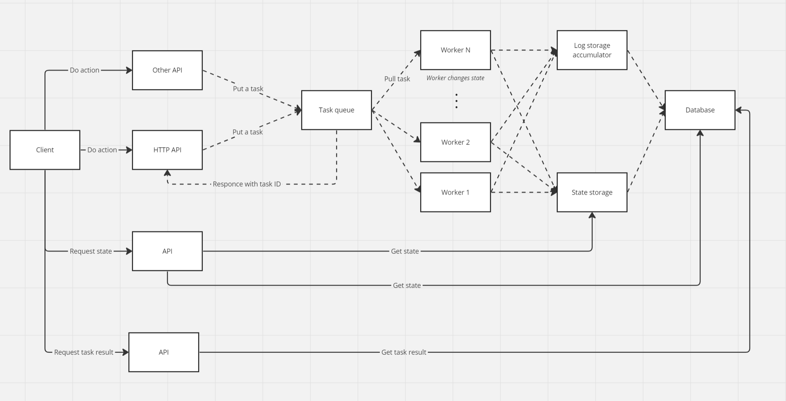

## Merge API

Who doesn't know what a merge-like game is? The rules are simple:
1. Create object on board
2. Merge them to create higher-level object

My idea is to create an API to handle such mechanic, so anybody can use this API to create a 
merge-like game

Base idea 

### Things left to implement

- [ ] Sync board states across redis and postgresql on board-access level